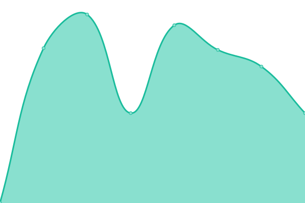

# [📈 Live Status](https://ajuntament-sabarca.github.io/upptime): <!--live status--> **🟩 All systems operational**

This repository contains the open-source uptime monitor and status page for [Ajuntament de Sant Andreu de la Barca](https://www.sabarca.cat), powered by [Upptime](https://github.com/upptime/upptime).

With [Upptime](https://upptime.js.org), you can get your own unlimited and free uptime monitor and status page, powered entirely by a GitHub repository. We use [Issues](https://github.com/ajuntament-sabarca/upptime/issues) as incident reports, [Actions](https://github.com/ajuntament-sabarca/upptime/actions) as uptime monitors, and [Pages](https://ajuntament-sabarca.github.io/upptime) for the status page.

<!--start: status pages-->
<!-- This summary is generated by Upptime (https://github.com/upptime/upptime) -->
<!-- Do not edit this manually, your changes will be overwritten -->
<!-- prettier-ignore -->
| URL | Status | History | Response Time | Uptime |
| --- | ------ | ------- | ------------- | ------ |
|  [sabarca.cat](https://sabarca.cat) | 🟩 Up | [sabarca-cat.yml](https://github.com/ajuntament-sabarca/upptime/commits/HEAD/history/sabarca-cat.yml) | 

 705ms
     
 | 

<a href="https://ajuntament-sabarca.github.io/upptime/history/sabarca-cat">100.00%</a>
    

|  [esports.sabarca.cat](https://esports.sabarca.cat) | 🟩 Up | [esports-sabarca-cat.yml](https://github.com/ajuntament-sabarca/upptime/commits/HEAD/history/esports-sabarca-cat.yml) | 

 694ms
     
 | 

<a href="https://ajuntament-sabarca.github.io/upptime/history/esports-sabarca-cat">100.00%</a>
    

|  [emmdsab.sabarca.cat](https://emmdsab.sabarca.cat) | 🟩 Up | [emmdsab-sabarca-cat.yml](https://github.com/ajuntament-sabarca/upptime/commits/HEAD/history/emmdsab-sabarca-cat.yml) | 

 693ms
     
 | 

<a href="https://ajuntament-sabarca.github.io/upptime/history/emmdsab-sabarca-cat">100.00%</a>
    

|  [saburba.sabarca.cat](https://saburba.sabarca.cat) | 🟩 Up | [saburba-sabarca-cat.yml](https://github.com/ajuntament-sabarca/upptime/commits/HEAD/history/saburba-sabarca-cat.yml) | 

 627ms
     
 | 

<a href="https://ajuntament-sabarca.github.io/upptime/history/saburba-sabarca-cat">100.00%</a>
    

|  [radiosantandreu.com](https://radiosantandreu.com) | 🟩 Up | [radiosantandreu-com.yml](https://github.com/ajuntament-sabarca/upptime/commits/HEAD/history/radiosantandreu-com.yml) | 

 1889ms
     
 | 

<a href="https://ajuntament-sabarca.github.io/upptime/history/radiosantandreu-com">100.00%</a>
    

<!--end: status pages-->

[**Visit our status website →**](https://ajuntament-sabarca.github.io/upptime)

## 📄 License

- Powered by: [Upptime](https://github.com/upptime/upptime)
- Code: [MIT](./LICENSE) © [Ajuntament de Sant Andreu de la Barca](https://www.sabarca.cat)
- Data in the `./history` directory: [Open Database License](https://opendatacommons.org/licenses/odbl/1-0/)
